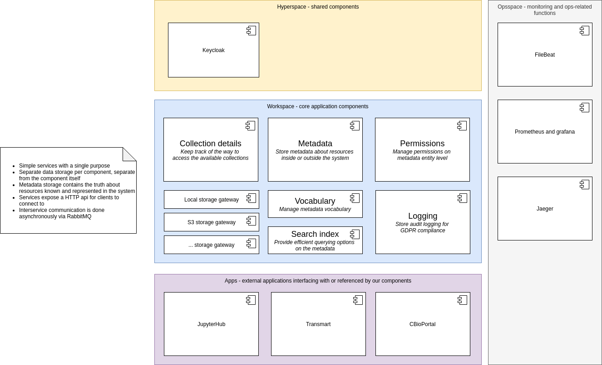
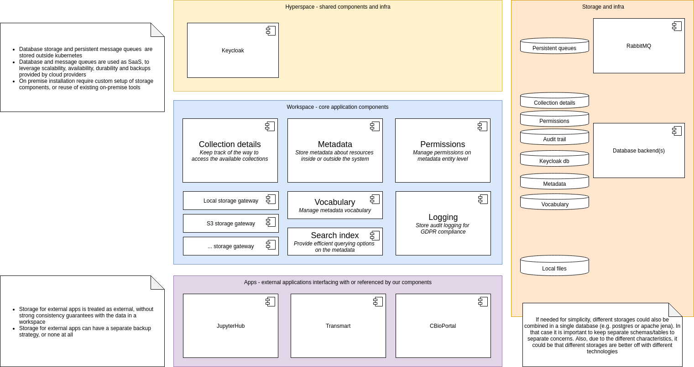

# Goal architecture and basic principles

* **Status**: rejected

* **Context**: The requirements for Fairspace and the insights on the best solutions are continuously evolving. However, there is
  a need for a direction where to go to and some guidance on the choices to make. To support those choices, this document describes
  the goal architecture that we want to strive for, based on the current insights. As an explanation for the choices for in this 
  proposal and to help making changes when requirements change, this document also lists a list of architectural principles.    

* **Principles**: the following principles are used when making decisions on the architecture. Please note that they are not set in 
  stone, nor is this list complete. It can be adjusted or extended when the need arises. However, the principles do help in guiding the way.
  * **Flexibility**: because of the ever-changing requirements and customer wishes, the architecture should be flexible. It should allow easy addition of new concepts and allow for changes to parts of the system without too much impact on the rest
  * **Continuous delivery**: the architecture should allow for continuous delivery of updates to the system. This allows for fast development and testing and short feedback loops. Testing should be done automatically to assure quality control. 
  * **Allow multiple instances of services**: the different service components in the architecture should be stateless in order to run multiple instances of them. This allows for easy scalability, ensuring availability and zero-downtime updates
  * **Loose coupling**: in order to be flexible, different parts of the system should be loosely coupled. This allows for changes to parts of the system without impact to other parts.
  * **Use existing standards where possible**: for many use cases there are existing standards that can be reused. This makes integration with external systems much easier. 

* **High level architecture** Following from the functional requirements to the system, we can distinguish 3 major contexts within our application:

  * Metadata: metadata about resources inside or outside the system. This metadata is closely related to the metadata vocabulary. Additionally, there should be a way to efficiently search the metadata
  * Collection details: collections are entities within our system that we know something about. This could be the location on disk or the S3 credentials. With this information, we can provide a view on the contents of a collection
  * Permissions: the system should allow permissions on the level of metadata entities. Related to the permissions is the logging of an audit trail for business reasons 

  

  All this functionality is part of what we call a workspace. Related functionality is provided by existing systems:
 
  * Keycloak for authentication. Many parts of a workspace depend on keycloak for authentication and verification of tokens
  * JupyterHub for workflows. JupyterHub depends on a workspace to show collection contents and on Keycloak for authentication
  * Transmart/CBioPortal for external data. Our metadata can have a weak dependency on those systems, describing metadata about entities in these systems
  * FileBeat, Prometheus, Grafana, Jaeger are tools needed to operate the system properly. There is no dependency from the workspace on these tools

* **Data storage**
  Our system has several distinct types of data to store: metadata, files, vocabulary, permissions, 
  collection details, audit trail. They all have different structure. In order to keep a flexible, 
  loosely coupled system, it is suggested to use the 'database-as-a-service' pattern. This means 
  that a service is responsible for its own data and data should only be accessed via that service. 
  This does not mean that the data can not be in a single database, however there should be separate 
  tables/schemas within the database.
  
  Nearly all storage within our system has requirements in terms of durability and persistence. 
  This means that the data should be stored persistently. However, the services we have yet created 
  are created to be explicitly not-persistent. They are (should be) stateless (in that it does not keep state in memory) 
  in order to allow for  horizontal scaling, cluster changes, improved availability and zero-downtime updates. For that 
  reason, it makes sense to keep the persistent data outside the cluster where the services run. This 
  makes it possible to add guarantees on the database in terms of durability and disaster recovery, 
  separate from the application requirements. 
  
  
  
  When running in a cloud environment it makes most sense to leverage existing cloud databases 
  (like Microsoft CosmosDB or Google Cloud Datastore). These services have high levels of availability, 
  replication, low-latency and backups, Moreover, it makes it possible for us to focus on application 
  development instead of database administration.
  
  When running on premise we could either use existing database clusters if possible. Otherwise, 
  we should install our own database and provide the necessary guarantees around it.
  
